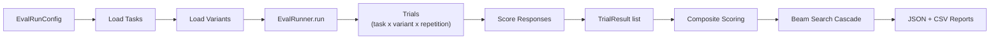
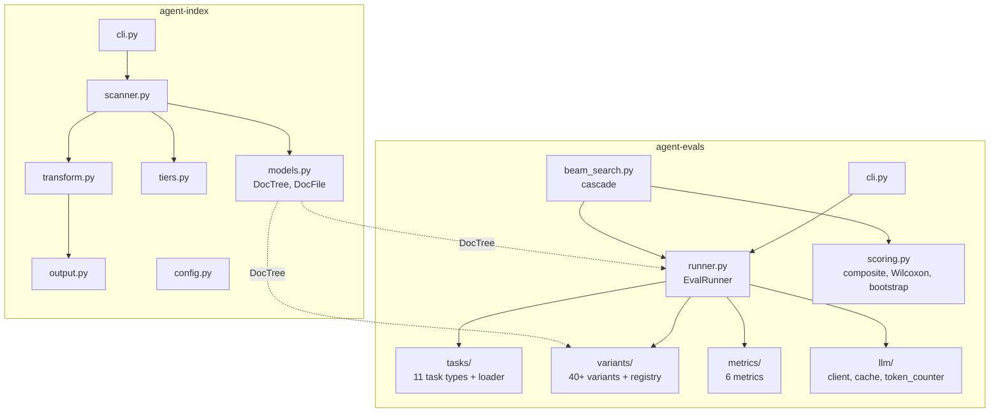
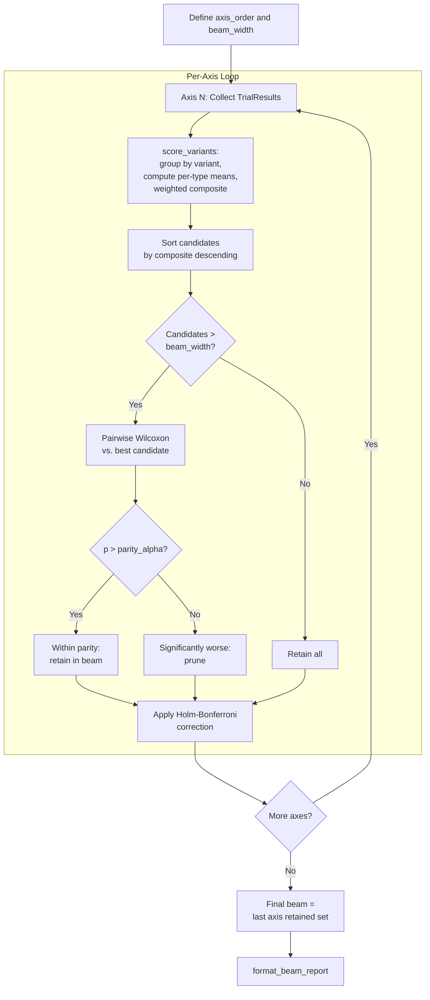
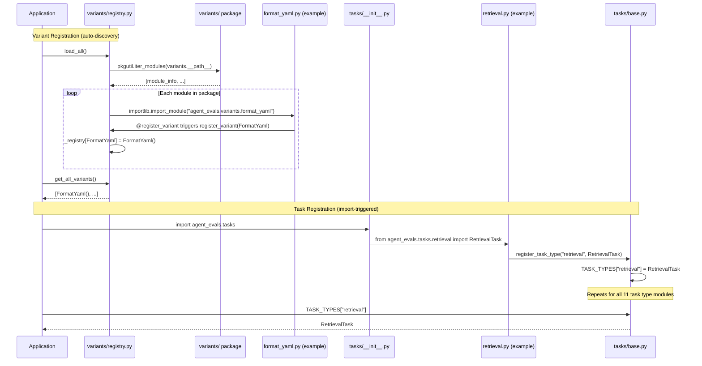

# Architecture

This document describes the high-level architecture of the AI Documentation Testing framework, including the evaluation pipeline, package structure, beam search cascade, and variant/task registration flow.

---

## 1. Pipeline Overview

The evaluation pipeline flows from configuration through task execution to final reporting.

**Key data flow:**

1. **Config** (`EvalRunConfig`) defines repetitions, concurrency, temperature, caching, and output directory.
2. **Tasks** are loaded from YAML via `load_tasks()`, validated against `TaskDefinition`, and dispatched to the correct `EvalTask` subclass.
3. **Variants** are loaded via `load_all()` auto-discovery, each rendering a `DocTree` into an index string.
4. **Trials** are the cross-product of (task, variant, repetition), executed concurrently via `ThreadPoolExecutor`.
5. **Scoring** happens per-trial via `task.score_response()`, then aggregated into per-type means and weighted into a composite score.
6. **Beam search** cascades across axes to identify the best variant configuration.
7. **Reports** are saved as timestamped JSON and CSV files.

---

## 2. Package Structure

The workspace is a UV monorepo with two packages.

**agent-index** scans a documentation tree, assigns tiers, transforms content, and outputs `.llms.md` index files. Its `DocTree` model is the primary input to agent-evals variants.

**agent-evals** evaluates how well an LLM agent performs when given an index produced by a variant. It contains the task types, variant registry, metrics, LLM client, scoring statistics, and beam search.

---

## 3. Beam Search Cascade

The beam search processes axes in a configured order, scoring all variants per axis and pruning to a fixed beam width. Statistical parity prevents premature elimination.

**Key parameters:**

| Parameter | Default | Purpose |
|-----------|---------|---------|
| `beam_width` | 3 | Maximum candidates retained per axis |
| `parity_alpha` | 0.10 | Wilcoxon p-value threshold; p > alpha means "cannot distinguish from best" |
| `n_bootstrap` | 1000 | Bootstrap resamples for confidence intervals |
| `weights` | `DEFAULT_WEIGHTS` | Task-type weights for composite scoring |

**Statistical methods used:**

- **Wilcoxon signed-rank test** (`scipy.stats.wilcoxon`) for paired comparisons.
- **Holm-Bonferroni correction** for multiple comparison control.
- **BCa bootstrap** (`scipy.stats.bootstrap`, method="BCa") for confidence intervals.
- **Rank-biserial correlation** as the effect size measure.

---

## 4. Variant and Task Registration Flow

Both variants and tasks use registry patterns for extensibility. Variants use decorator-based auto-discovery; tasks use explicit function-call registration triggered by module import.

**Variant registration** is fully automatic: placing a file in `agent-evals/src/agent_evals/variants/` and applying `@register_variant` is sufficient. The `load_all()` function walks the package with `pkgutil.iter_modules` and imports every module.

**Task registration** is import-triggered: the `tasks/__init__.py` imports each concrete task module, and each module calls `register_task_type()` at module level, overriding the `GenericTask` default in the `TASK_TYPES` dict. A lazy guard in `loader.py` (`_ensure_registered()`) ensures this happens even when the loader is imported directly.
