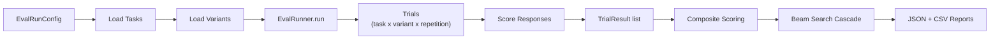
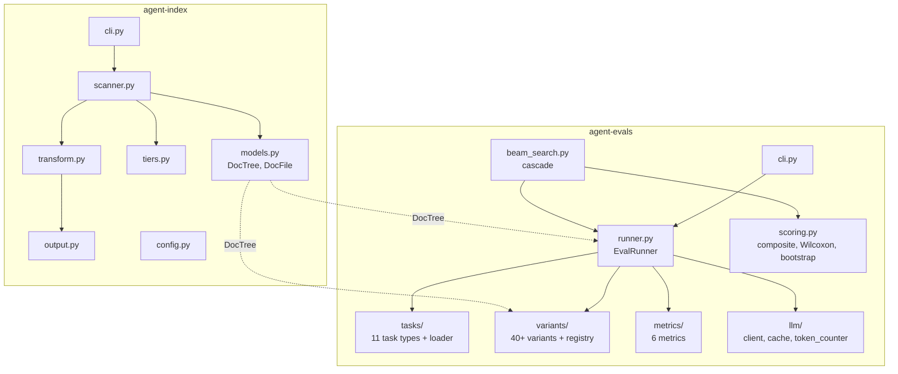
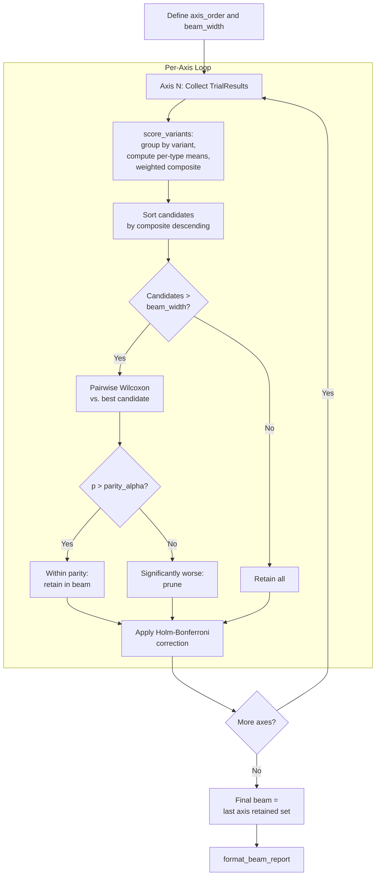
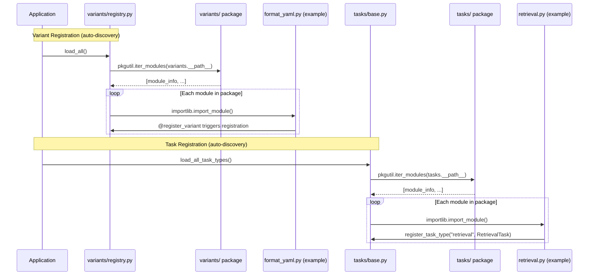
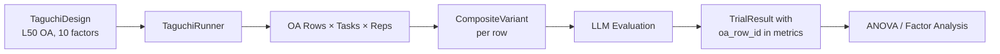
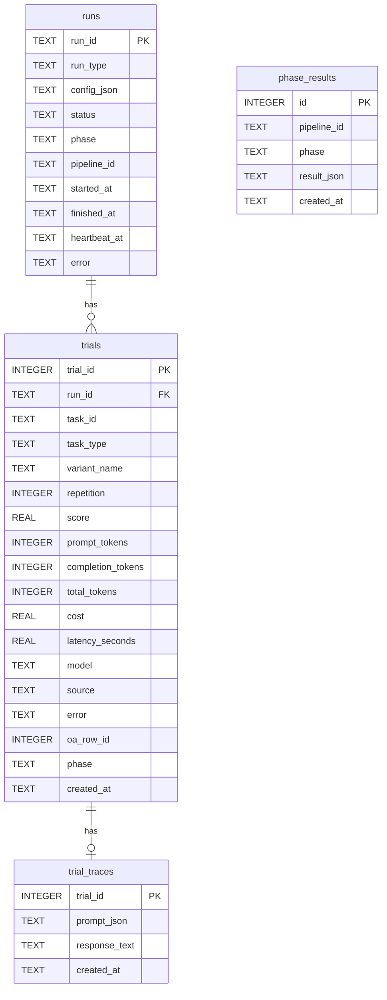
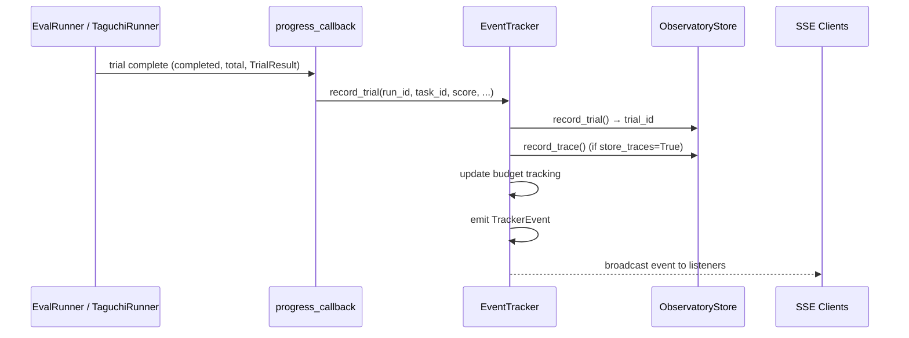
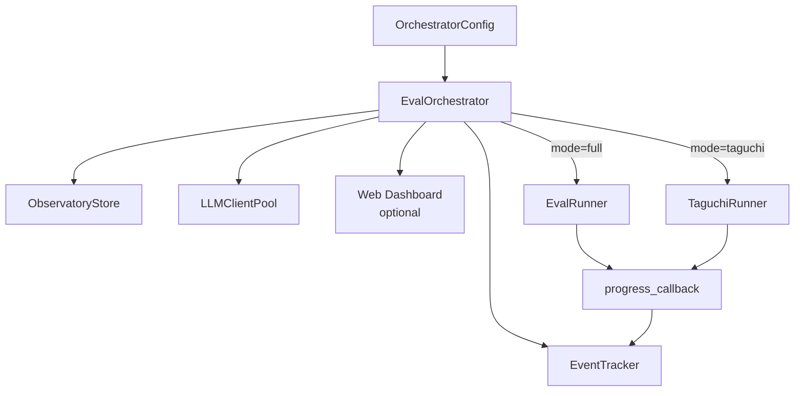

# Architecture

This document describes the high-level architecture of the AI Documentation Testing framework, including the evaluation pipeline, package structure, beam search cascade, and variant/task registration flow.

---

## 1. Pipeline overview

The evaluation pipeline flows from configuration through task execution to final reporting.

```mermaid
flowchart LR
    A[EvalRunConfig] --> B[Load Tasks]
    B --> C[Load Variants]
    C --> D[EvalRunner.run]
    D --> E["Trials\n(task x variant x repetition)"]
    E --> F[Score Responses]
    F --> G[TrialResult list]
    G --> H[Composite Scoring]
    H --> I[Beam Search Cascade]
    I --> J[JSON + CSV Reports]
```

**Key data flow:**

1. **Config** (`EvalRunConfig`) defines repetitions, concurrency, temperature, caching, and output directory.
2. **Tasks** are loaded from YAML via `load_tasks()`, validated against `TaskDefinition`, and dispatched to the correct `EvalTask` subclass.
3. **Variants** are loaded via `load_all()` auto-discovery, each rendering a `DocTree` into an index string.
4. **Trials** are the cross-product of (task, variant, repetition), executed concurrently via `ThreadPoolExecutor`.
5. **Scoring** happens per-trial via `task.score_response()`, then aggregated into per-type means and weighted into a composite score.
6. **Beam search** cascades across axes to identify the best variant configuration.
7. **Reports** are saved as timestamped JSON and CSV files.
8. **Logging** via `configure_logging()` provides `--verbose`/`--quiet` control over log verbosity.
9. **Progress callbacks** (`make_progress_callback`) report trial completion in `rich`, `plain`, or `none` display modes.
10. **Error resilience** via `--continue-on-error` allows partial result collection when individual trials fail.

---

## 2. Package structure

The workspace is a UV monorepo with two packages.

```mermaid
graph TB
    subgraph "agent-index"
        AI_SCAN[scanner.py]
        AI_MODELS[models.py<br/>DocTree, DocFile]
        AI_TIERS[tiers.py]
        AI_TRANSFORM[transform.py]
        AI_OUTPUT[output.py]
        AI_CONFIG[config.py]
        AI_CLI[cli.py]

        AI_CLI --> AI_SCAN
        AI_SCAN --> AI_MODELS
        AI_SCAN --> AI_TIERS
        AI_SCAN --> AI_TRANSFORM
        AI_TRANSFORM --> AI_OUTPUT
    end

    subgraph "agent-evals"
        AE_CLI[cli.py]
        AE_RUNNER[runner.py<br/>EvalRunner]
        AE_TASKS[tasks/<br/>11 task types + loader]
        AE_VARIANTS[variants/<br/>40+ variants + registry]
        AE_METRICS[metrics/<br/>6 metrics]
        AE_SCORING[scoring.py<br/>composite, Wilcoxon, bootstrap]
        AE_BEAM[beam_search.py<br/>cascade]
        AE_LLM[llm/<br/>client, cache, token_counter]

        AE_CLI --> AE_RUNNER
        AE_RUNNER --> AE_TASKS
        AE_RUNNER --> AE_VARIANTS
        AE_RUNNER --> AE_LLM
        AE_RUNNER --> AE_METRICS
        AE_BEAM --> AE_RUNNER
        AE_BEAM --> AE_SCORING
    end

    AI_MODELS -.->|DocTree| AE_VARIANTS
    AI_MODELS -.->|DocTree| AE_RUNNER
```

**agent-index** scans a documentation tree, assigns tiers, transforms content, and outputs `.llms.md` index files. Its `DocTree` model is the primary input to agent-evals variants.

**agent-evals** evaluates how well an LLM agent performs when given an index produced by a variant. It contains the task types, variant registry, metrics, LLM client, scoring statistics, and beam search.

---

## 3. Beam search cascade

The beam search processes axes in a configured order, scoring all variants per axis and pruning to a fixed beam width. Statistical parity prevents premature elimination.

```mermaid
flowchart TD
    START[Define axis_order and beam_width] --> A1

    subgraph "Per-Axis Loop"
        A1[Axis N: Collect TrialResults] --> A2[score_variants:<br/>group by variant,<br/>compute per-type means,<br/>weighted composite]
        A2 --> A3[Sort candidates<br/>by composite descending]
        A3 --> A4{Candidates ><br/>beam_width?}
        A4 -- No --> A5[Retain all]
        A4 -- Yes --> A6[Pairwise Wilcoxon<br/>vs. best candidate]
        A6 --> A7{p > parity_alpha?}
        A7 -- Yes --> A8[Within parity:<br/>retain in beam]
        A7 -- No --> A9[Significantly worse:<br/>prune]
        A8 --> A10[Apply Holm-Bonferroni<br/>correction]
        A9 --> A10
        A5 --> A10
    end

    A10 --> NEXT{More axes?}
    NEXT -- Yes --> A1
    NEXT -- No --> FINAL[Final beam =<br/>last axis retained set]
    FINAL --> REPORT[format_beam_report]
```

**Key parameters:**

| Parameter | Default | Purpose |
|-----------|---------|---------|
| `beam_width` | 3 | Maximum candidates retained per axis |
| `parity_alpha` | 0.10 | Wilcoxon p-value threshold; p > alpha means "cannot distinguish from best" |
| `n_bootstrap` | 1000 | Bootstrap resamples for confidence intervals |
| `weights` | `DEFAULT_WEIGHTS` | Task-type weights for composite scoring |

**Statistical methods used:**

- **Wilcoxon signed-rank test** (`scipy.stats.wilcoxon`) for paired comparisons.
- **Holm-Bonferroni correction** for multiple comparison control.
- **BCa bootstrap** (`scipy.stats.bootstrap`, method="BCa") for confidence intervals.
- **Rank-biserial correlation** as the effect size measure.

---

## 4. Variant and task registration flow

Both variants and tasks use registry patterns with auto-discovery for extensibility. Variants use `load_all()` in `registry.py` with decorator-based registration; tasks use `load_all_task_types()` in `base.py` which walks the package with `pkgutil.iter_modules`, importing each module which calls `register_task_type()` at module level.

```mermaid
sequenceDiagram
    participant App as Application
    participant VReg as variants/registry.py
    participant VPkg as variants/ package
    participant VMod as format_yaml.py (example)
    participant TBase as tasks/base.py
    participant TPkg as tasks/ package
    participant TMod as retrieval.py (example)

    Note over App,VReg: Variant Registration (auto-discovery)
    App->>VReg: load_all()
    VReg->>VPkg: pkgutil.iter_modules(variants.__path__)
    VPkg-->>VReg: [module_info, ...]
    loop Each module in package
        VReg->>VMod: importlib.import_module()
        VMod->>VReg: @register_variant triggers registration
    end

    Note over App,TBase: Task Registration (auto-discovery)
    App->>TBase: load_all_task_types()
    TBase->>TPkg: pkgutil.iter_modules(tasks.__path__)
    TPkg-->>TBase: [module_info, ...]
    loop Each module in package
        TBase->>TMod: importlib.import_module()
        TMod->>TBase: register_task_type("retrieval", RetrievalTask)
    end
```

**Variant registration** is fully automatic: placing a file in `agent-evals/src/agent_evals/variants/` and applying `@register_variant` is sufficient. The `load_all()` function walks the package with `pkgutil.iter_modules` and imports every module.

**Task registration** follows the same auto-discovery pattern: `load_all_task_types()` in `tasks/base.py` walks the `tasks/` package with `pkgutil.iter_modules` and imports every module. Each module calls `register_task_type()` at module level, overriding the `GenericTask` default in the `TASK_TYPES` dict. The `tasks/__init__.py` simply calls `load_all_task_types()` to trigger discovery on package import.

---

## 5. Taguchi DOE pipeline

The Taguchi mode replaces the full Cartesian product (all variants × all tasks × repetitions) with a statistically efficient orthogonal array (OA) design. This reduces trial count from hundreds of thousands to thousands while still identifying significant factors.

```mermaid
flowchart LR
    A[TaguchiDesign<br/>L50 OA, 10 factors] --> B[TaguchiRunner]
    B --> C["OA Rows × Tasks × Reps"]
    C --> D[CompositeVariant<br/>per row]
    D --> E[LLM Evaluation]
    E --> F[TrialResult with<br/>oa_row_id in metrics]
    F --> G[ANOVA / Factor Analysis]
```

**Key concepts:**

- **Factors** correspond to the 10 format axes (structure, detail level, etc.) plus optionally the model. Each factor has 2–5 levels (variants for that axis).
- **Orthogonal array** (L50) ensures balanced coverage of factor combinations in far fewer trials than full factorial.
- **CompositeVariant** merges one variant per axis into a single index for evaluation. Built from `TaguchiExperimentRow.assignments`.
- **Multi-model support** — when `model` is a factor in the design, the runner selects the appropriate `LLMClient` per row via `_select_client()`.

### DOE pipeline phases

The `DOEPipeline` orchestrates a multi-phase experiment:

| Phase | Purpose | Input | Output |
|-------|---------|-------|--------|
| **Screening** | Identify significant factors from the full L50 OA | All 10 factors | Ranked factor list with p-values |
| **Confirmation** | Validate top-K factors with increased repetitions | Top-K factors | Confirmed significant factors |
| **Refinement** | Fine-tune levels of confirmed factors | Confirmed factors | Optimal configuration |

Each phase creates its own `run_id` (linked by `pipeline_id`) and stores results in the observatory DB. The pipeline automatically transitions between phases, reconstructing `PhaseResult` objects from completed phases on resume.

---

## 6. Observatory

The observatory subsystem provides real-time telemetry and persistent storage for all evaluation runs.

### Database schema (`observatory.db`)

```mermaid
erDiagram
    runs {
        TEXT run_id PK
        TEXT run_type
        TEXT config_json
        TEXT status
        TEXT phase
        TEXT pipeline_id
        TEXT started_at
        TEXT finished_at
        TEXT heartbeat_at
        TEXT error
    }
    trials {
        INTEGER trial_id PK
        TEXT run_id FK
        TEXT task_id
        TEXT task_type
        TEXT variant_name
        INTEGER repetition
        REAL score
        INTEGER prompt_tokens
        INTEGER completion_tokens
        INTEGER total_tokens
        REAL cost
        REAL latency_seconds
        TEXT model
        TEXT source
        TEXT error
        INTEGER oa_row_id
        TEXT phase
        TEXT created_at
    }
    trial_traces {
        INTEGER trial_id PK
        TEXT prompt_json
        TEXT response_text
        TEXT created_at
    }
    phase_results {
        INTEGER id PK
        TEXT pipeline_id
        TEXT phase
        TEXT result_json
        TEXT created_at
    }

    runs ||--o{ trials : "has"
    trials ||--o| trial_traces : "has"
```

### Components

| Component | File | Role |
|-----------|------|------|
| **ObservatoryStore** | `observatory/store.py` | SQLite persistence — CRUD for runs, trials, traces, phases. WAL mode enabled. |
| **EventTracker** | `observatory/tracker.py` | Bridges runner callbacks to store. Tracks per-model budgets, optionally stores traces. |
| **Web dashboard** | `observatory/web/` | FastAPI app with SSE streaming, REST API, and static frontend. |
| **Routes** | `observatory/web/routes.py` | API endpoints: runs list, run detail, trials, live SSE stream, trace retrieval. |

### Event flow

```mermaid
sequenceDiagram
    participant Runner as EvalRunner / TaguchiRunner
    participant CB as progress_callback
    participant Tracker as EventTracker
    participant Store as ObservatoryStore
    participant SSE as SSE Clients

    Runner->>CB: trial complete (completed, total, TrialResult)
    CB->>Tracker: record_trial(run_id, task_id, score, ...)
    Tracker->>Store: record_trial() → trial_id
    Tracker->>Store: record_trace() (if store_traces=True)
    Tracker->>Tracker: update budget tracking
    Tracker->>Tracker: emit TrackerEvent
    Tracker-->>SSE: broadcast event to listeners
```

---

## 7. Orchestrator

`EvalOrchestrator` is the top-level coordinator that wires all subsystems together.

```mermaid
flowchart TD
    Config[OrchestratorConfig] --> Orch[EvalOrchestrator]
    Orch --> Store[ObservatoryStore]
    Orch --> Tracker[EventTracker]
    Orch --> Pool[LLMClientPool]
    Orch --> Dashboard[Web Dashboard<br/>optional]

    Orch -->|mode=full| EvalRunner
    Orch -->|mode=taguchi| TaguchiRunner

    EvalRunner --> CB[progress_callback]
    TaguchiRunner --> CB
    CB --> Tracker
```

**Responsibilities:**

1. **Mode routing** — dispatches to `EvalRunner` (full sweep) or `TaguchiRunner` (Taguchi DOE) based on `config.mode`.
2. **Telemetry wiring** — creates the `progress_callback` that bridges `TrialResult` events to `EventTracker.record_trial()`, forwarding prompt messages and response text when trace storage is enabled.
3. **Client pool** — manages `LLMClientPool` for multi-model runs with per-model budget caps.
4. **Dashboard lifecycle** — optionally starts the FastAPI web dashboard in a background thread via `launch_dashboard()`.
5. **Run lifecycle** — creates run records in the store, marks runs as completed or failed (including graceful shutdown detection).
6. **Report aggregation** — optionally generates `ReportData` via `aggregate()` after the run completes.

---

## 8. Trace storage

Prompt/response observability is opt-in via `--store-traces`.

- **Separate table** (`trial_traces`) keeps the `trials` table lean for aggregate queries. Traces can be 16–20k chars per prompt; a full Taguchi run could add ~3.5 GB.
- **Prompt stored as JSON** (`list[dict]`) preserving the message structure (system, user, assistant roles) for future Langfuse or LangSmith import.
- **Idempotent writes** — `INSERT OR IGNORE` prevents duplicate traces on resume.
- **On-demand retrieval** — `GET /api/trials/{trial_id}/trace` returns a single trace (not bulk) to avoid memory pressure.

**Data flow:** `TrialResult.prompt_messages` → `EventTracker.record_trial(prompt_messages=...)` → `ObservatoryStore.record_trace(trial_id, prompt_json, response_text)`.

---

## 9. Checkpointing and resume

The observatory DB itself serves as the checkpoint — every completed trial is persisted immediately via the tracker. No separate checkpoint file is needed.

### Resume modes

| Flag | Scope | Behavior |
|------|-------|----------|
| `--resume <run_id>` | Single run | Reactivates the run (`status → active`), loads completed trial keys, filters work items |
| `--resume-pipeline <pipeline_id>` | DOE pipeline | Skips completed phases, resumes the in-progress phase |

### Trial key filtering

On resume, `get_completed_trial_keys(run_id)` returns a `set[tuple[oa_row_id, task_id, variant_name, repetition]]` for all non-error trials. The runner filters its work item list against this set before submitting to the thread pool.

### Graceful shutdown

Both runners install `SIGINT`/`SIGTERM` handlers that set a `threading.Event`. The executor loop checks this event before submitting new futures. In-flight trials complete normally. The orchestrator marks the run as `failed` with `error="graceful_shutdown"`, making it resumable.

### WAL checkpointing

`ObservatoryStore.checkpoint_wal()` calls `PRAGMA wal_checkpoint(TRUNCATE)` to flush the write-ahead log to the main database file. The Taguchi runner calls this after each completed OA row to minimize data loss on crash.
